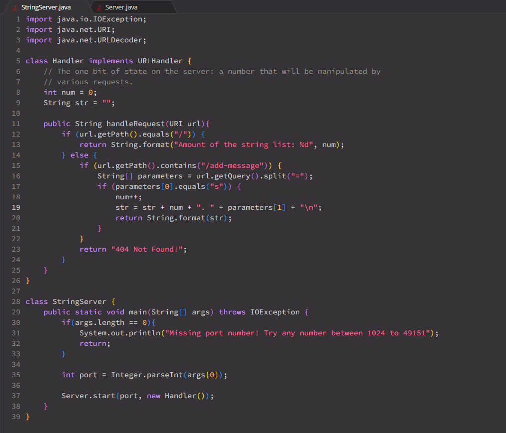
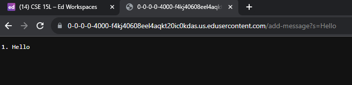
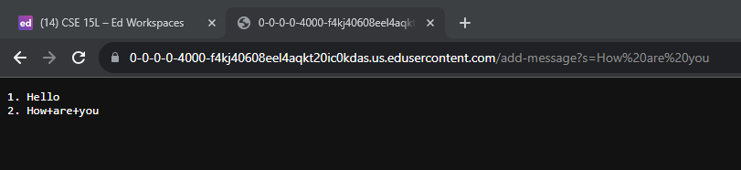
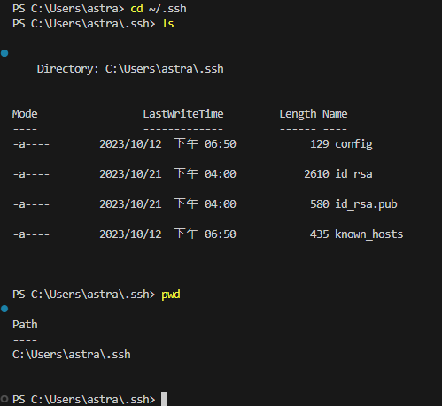
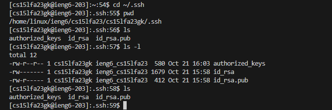
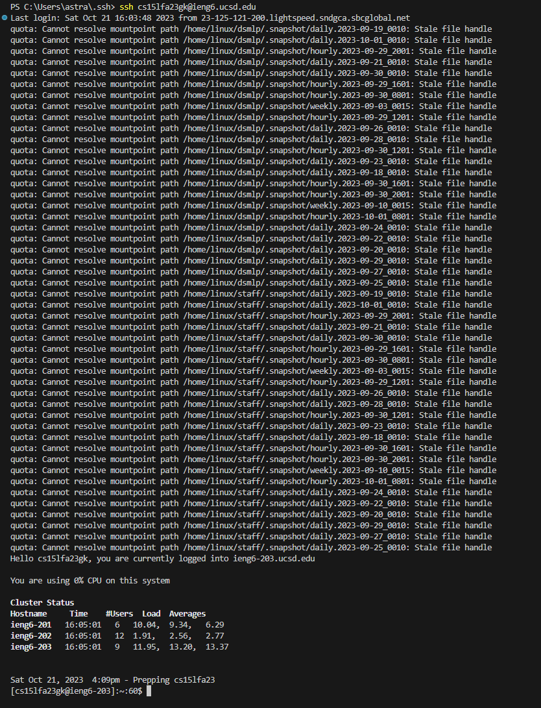

# Lab Report 2 - Servers and SSH Keys (Week 3)
## Part 1 
**1. The code for my `StringServer`

** 2. Using `/add-message?s=Hello`

I have called `getPath()`, `equals()`, `getQuery()` and `split()`. 

** 3. Using `/add-message?s=How are you`

## Part 2
**1. The path to the private key for your SSH key for logging into ieng6

**2. The path to the public key for your SSH key for logging into ieng6

**3. Log into ieng6 without being asked for a password.

## Part 3
I have learned ssh to a remote server and how to run the server either on EdStem or on ieng6, and interact with it by using the "path" and "query" I've also leared how to run the server on my local computer, and lastly using SSH key to connect to ieng6 server without being asked for a password.
