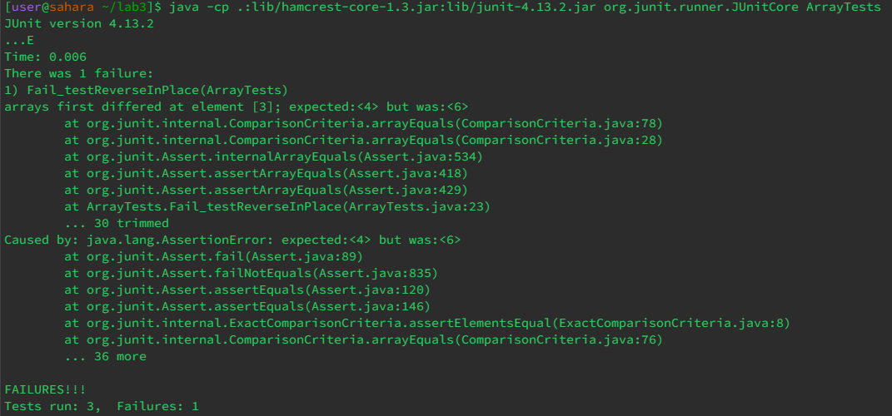
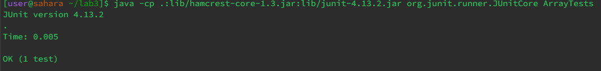
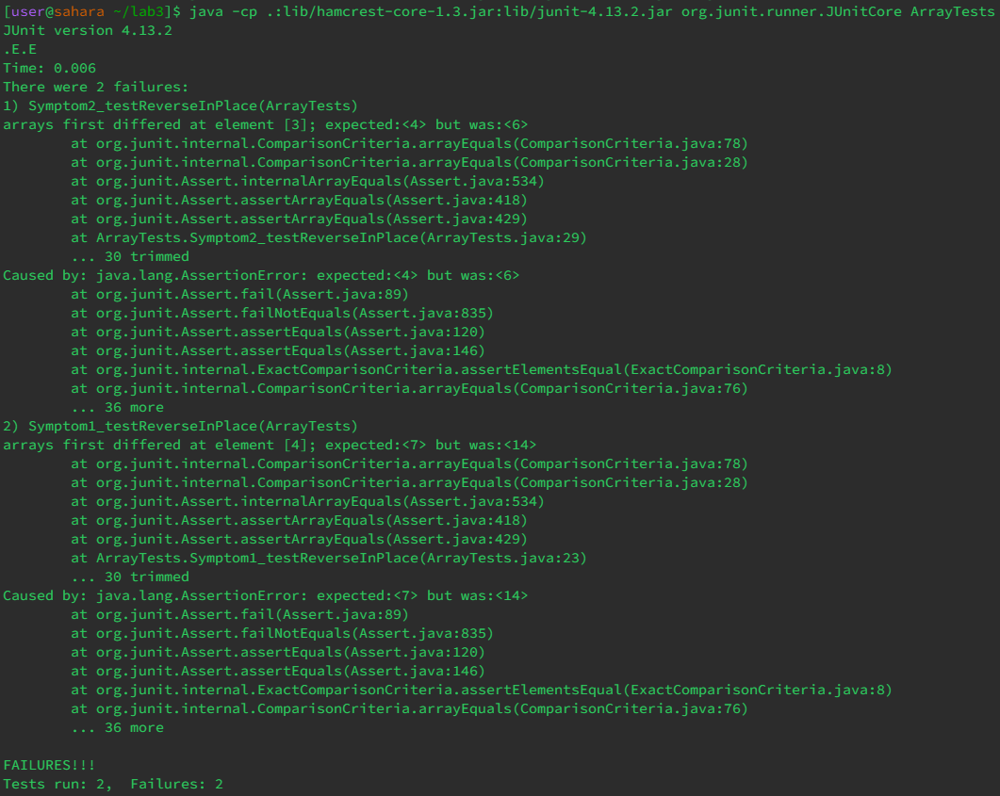

# Lab Report 3 - Bugs and Commands (Week 5)
## Part 1 - Bug for `testReverseInPlace`

**A Failure-Inducing Input**
---
```	
@Test 
public void Fail_testReverseInPlace() {
  int[] input1 = { 3, 4, 5, 6, 7 };
  ArrayExamples.reverseInPlace(input1);
  assertArrayEquals(new int[]{ 7, 6, 5, 4, 3 }, input1);
}
```


The function I am testing is:
```  
static void reverseInPlace(int[] arr) {
  for(int i = 0; i < arr.length; i += 1) {
    arr[i] = arr[arr.length - i - 1];
  }
}
```

 **An Input That Doesn’t Induce a Failure**
---
```
@Test 
public void testReverseInPlace() {
  int[] input1 = { 3 };
  ArrayExamples.reverseInPlace(input1);
  assertArrayEquals(new int[]{ 3 }, input1);
}
```



The function I am testing is:
```  
static void reverseInPlace(int[] arr) {
  for(int i = 0; i < arr.length; i += 1) {
    arr[i] = arr[arr.length - i - 1];
  }
}
```

**The Symptom**
---


Here is the test I used:
```
@Test 
public void Symptom1_testReverseInPlace() {
  int[] input1 = { 1, 4, 7, 9, 14, 19, 23 };
  ArrayExamples.reverseInPlace(input1);
  assertArrayEquals(new int[]{ 23, 19, 14, 9, 7, 4, 1 }, input1);
}
@Test 
public void Symptom2_testReverseInPlace() {
  int[] input1 = { 3, 4, 5, 6, 7 }; 
  ArrayExamples.reverseInPlace(input1);
  assertArrayEquals(new int[]{ 7, 6, 5, 4, 3 }, input1);
}
```

**The Bug**
---
Before fixed:
```
static void reverseInPlace(int[] arr) {
  for(int i = 0; i < arr.length; i += 1) {
    arr[i] = arr[arr.length - i - 1];
  }
}
```

After fixed: 
```
static void reverseInPlace(int[] arr) {
  int[] tempArray = new int[arr.length];
  for(int i = 0; i < arr.length; i += 1) {
    tempArray[i] = arr[arr.length - i - 1];
  }
  for(int i = 0; i < arr.length; i += 1) {
    arr[i] = tempArray[i];
  }
}
```

I create another array that store the value then assign the reversed value back. Because before the fix, the same array are being use to store elements, the first element lost when the first `FOR` loop is excuted.


## Part 2 - `find` Command

**-name**
---

The command is to search for the exact path for files and directories.

**On Files**

Command:
```
find -name preface.txt
```
Output:
```
./911report/preface.txt
```

This command are able to find the file if I don't know where I saved it. So it is useful for finding a specific file without knowing the exact path.

**On Directories**

Command: 
```
find -name 911report
```
Output: 
```
./911report
```

This command are able to find the directory if I don't know where I saved it. It's useful when I am finding the directory but can't remember where it is.

Found from: <https://www.redhat.com/sysadmin/linux-find-command>


**-iname**
---

The command is to search for the exact path for files and directories(do not have to match capitalized characters).

**On Files**

Command: 
```
find -iname "chapter*.txt"
```
Output: 
```
./911report/chapter-1.txt
./911report/chapter-10.txt
./911report/chapter-11.txt
./911report/chapter-12.txt
./911report/chapter-13.1.txt
./911report/chapter-13.2.txt
./911report/chapter-13.3.txt
./911report/chapter-13.4.txt
./911report/chapter-13.5.txt
./911report/chapter-2.txt
./911report/chapter-3.txt
./911report/chapter-5.txt
./911report/chapter-6.txt
./911report/chapter-7.txt
./911report/chapter-8.txt
./911report/chapter-9.txt
```

This command are able to find the file if I don't know where I saved it. Additionally, it don't have to match capitalized characters. So it is useful for finding a specific file without knowing the exact path and whether I capitalized the characters.

**On Directories**

Command: 
```
find -iname "bio*"
```
Output: 
```
./biomed
```

This command are able to find the directory if I don't know where I saved it. Additionally, it don't have to match capitalized characters. It's useful when I am finding the directory but can't remember where it is.

Found from: <https://www.redhat.com/sysadmin/linux-find-command>


**-size**
---

Find files and directories based on size(`+` sign indicate to find the files or directories that are larger than the argument that provided after, `-` sign indicate smaller).

**On Files**

Command: 
```
find ./plos/pmed.0020191.txt -size 1k
```
Output: 
```
./plos/pmed.0020191.txt
```

This command are able to find the file based on their size. This is useful because I can test the file is larger, for example, 1Mb, or smaller.

**On Directories**

Command: 
```
find ./911report -size +1k
```
Output: 
```
./911report
./911report/chapter-1.txt
./911report/chapter-10.txt
./911report/chapter-11.txt
./911report/chapter-12.txt
./911report/chapter-13.1.txt
./911report/chapter-13.2.txt
./911report/chapter-13.3.txt
./911report/chapter-13.4.txt
./911report/chapter-13.5.txt
./911report/chapter-2.txt
./911report/chapter-3.txt
./911report/chapter-5.txt
./911report/chapter-6.txt
./911report/chapter-7.txt
./911report/chapter-8.txt
./911report/chapter-9.txt
./911report/preface.txt
```

This command are able to find the file in that directory based on their size. This is useful because I can test every file is larger, for example, 1Mb, or smaller. Let's say if we want to find a file that take extreme big storage then we can use this command to do that.

Found from: <https://tecadmin.net/linux-find-command-with-examples/>


**-type**
---

Find the path for directorys(-type d) or files(-type f).

**On Files**

Command:
```
find ./911report -type f
```
Output:
```
./911report/chapter-1.txt
./911report/chapter-10.txt
./911report/chapter-11.txt
./911report/chapter-12.txt
./911report/chapter-13.1.txt
./911report/chapter-13.2.txt
./911report/chapter-13.3.txt
./911report/chapter-13.4.txt
./911report/chapter-13.5.txt
./911report/chapter-2.txt
./911report/chapter-3.txt
./911report/chapter-5.txt
./911report/chapter-6.txt
./911report/chapter-7.txt
./911report/chapter-8.txt
./911report/chapter-9.txt
./911report/preface.txt
```

This command can find every thing that are files in that directory(including it's sub-directory). It is useful if we only want know the file in that directory. 

**On Directories**

Command: 
```
find ./ -type d
```
Output: 
```
./
./911report
./biomed
./government
./government/About_LSC
./government/Alcohol_Problems
./government/Env_Prot_Agen
./government/Gen_Account_Office
./government/Media
./government/Post_Rate_Comm
./plos
```

This command can find every thing that are directory in that directory(including it's sub-directory). It is useful if we only want know the directory in that directory.

Found from: <https://www.tecmint.com/35-practical-examples-of-linux-find-command/>


---

**Source**

<https://www.tecmint.com/35-practical-examples-of-linux-find-command/>

<https://tecadmin.net/linux-find-command-with-examples/>

<https://www.redhat.com/sysadmin/linux-find-command>

