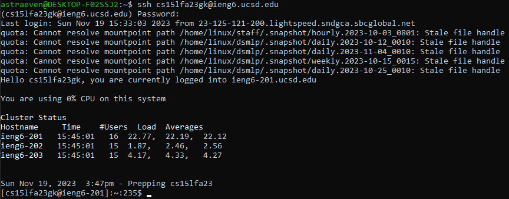
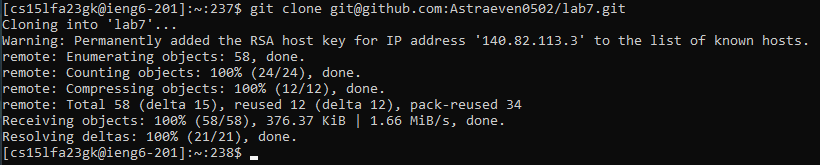
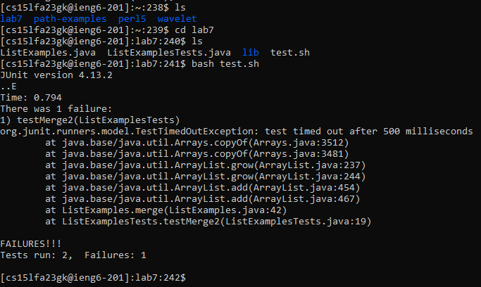
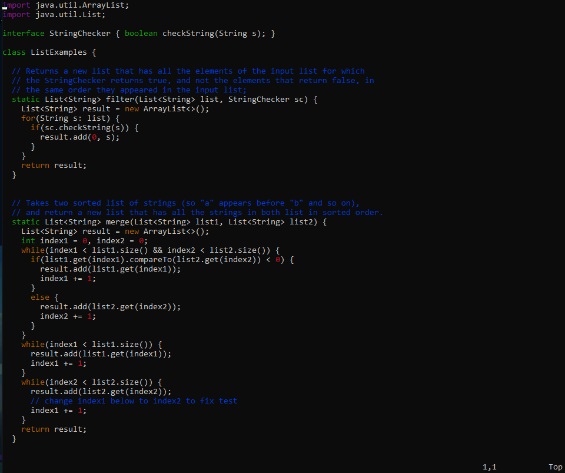
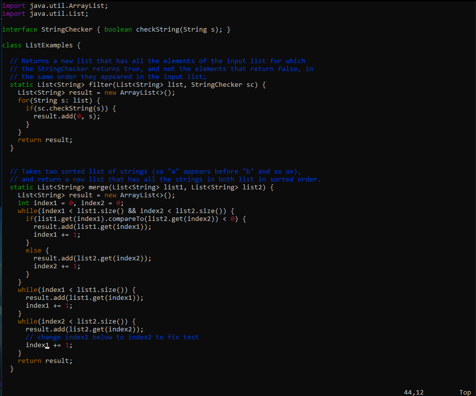
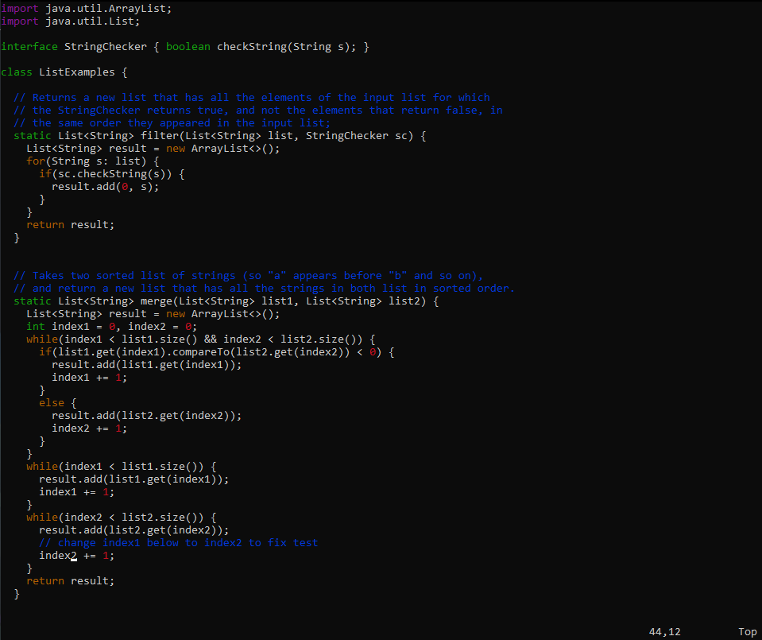
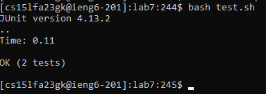
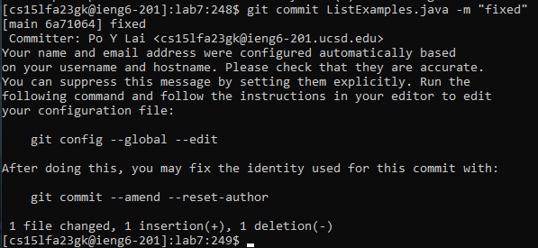
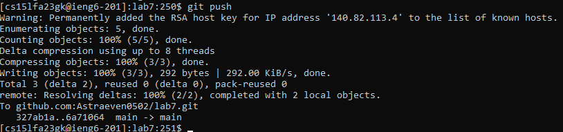

# Lab Report 4 - Vim (Week 7)

**Step 4**
---

Type `ssh cs15lfa23gk@ieng6.ucsd.edu` after that I pressed `<enter>`. Then type the password `<mypassword>` after that I pressed `<enter>`. Log into my ieng6 account.

**Step 5**
---

`Ctrl-C` copy `git@github.com:Astraeven0502/lab7.git` SSH URL from github.

Then type `git clone `.

Then `Ctrl-V` paste to terminal then press `<enter>`. We now successfully clone the repository to ieng6.

**Step 6**
---

Now we are in home directory, I want to go to the `lab7` directory so I type `cd lab7` then press `<enter>` to change the working directory.

Then run the bash by typing `bash test.sh` then press `<enter>`. test.sh is the bash script that run the test.

**Step 7**
---

We want to fix the code inside ListExamples.java so I type `vim ListExamples.java` to go into vim editer.

Then I press `43` and `<down>` to move the cursor to line 44 because the error we want to fix is on line 44. The `43` means repeat 43 times to the command after that(here it would repeat `<down>` for 43 times).

Then I press `11` and `<right>` to move the cursor to 12th character because the error we want to fix is the 12th character. The `11` means repeat 11 times to the command after that(here it would repeat `<right>` for 11 times).

Now, we succesfully move the cursor to the character that we want to fix.

Press `r` then press `2` to replace that character to 2.

Press `<shift> + ;` to type `:` then type `wq` then press `<enter>` to write(save) and quit the vim editer.

**Step 8**
---

Run the bash by typing `bash test.sh` then press `<enter>`.

**Step 9**
---

Type `git commit ListExamples.java -m "fixed"` then press `<enter>` to commit ListExample.java to git. The `-m` and the following quote `"fixed"` is to create a commit message(here the message would be `"fixed"`)

Type `git push` then press `<enter>` to push the change to github.
