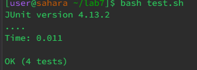

# Lab Report 5 - Putting it All Together (Week 9)

## Part 1 – Debugging Scenario

**A post from a student**
---
Every time I run testfilter1 it always gives me the wrong output but my testfilter2 is passed. It seems always ignore the first element. 


**A response from a TA**
---

The index for the string starts from 0. Also, if your for loop always ignores the first element, you might want to check your for loop condition

**Fixed the bug**
---



The bug is in the for loop condition, it always starts for index 1 which is wrong because it skip the first index which is index 0.


**All the information**
---

The file & directory structure
---


Before fixing the bug
---


The full command line to trigger the bug
---
The command `bash test.sh` trigger the bug

The content inside test.sh:

```
javac -cp .:lib/hamcrest-core-1.3.jar:lib/junit-4.13.2.jar *.java
java -cp .:lib/hamcrest-core-1.3.jar:lib/junit-4.13.2.jar org.junit.runner.JUnitCore ListExamplesTests
```

what to edit to fix the bug
---
Edit line 14 to initialize `i` from 1 to 0. Since the index starts from 0 not 1, we have to set the start condition to 0. If i start at 1 that would mean starting from the second element instead of the first element that we want.

## Part 2 – Reflection

Before the lab, I thought the autograder was complicated and I didn't know much about it. I thought it had to take the code from the submission as a string and run in a function that takes the code as an argument. It's just too complicated in my mind that I wasn't able to even imagine it.
But turns out that it is actually easy and straightforward, we set up what we need in bash to let it run a few commands and compare the result with the expected result. And all of that only is done with a bash script that runs some command automatically!
